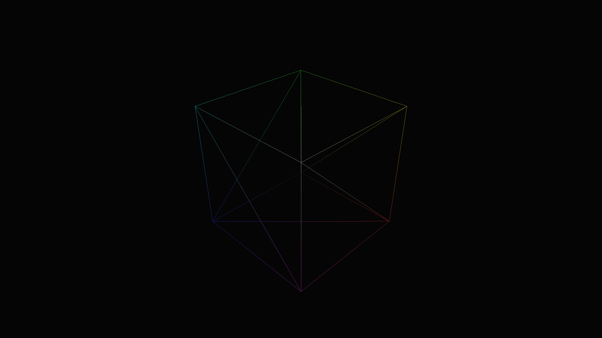

# OpenGL example - cubes
Simple example using OpenGL + GLFW.

## Controls
* [W A S D] - orbit all cubes around their pivot point
* [MouseLeft] - create a cube at the cursor's xy positions
* [Ctrl + MouseLeft] - create a cube at the cursor's xy with pivot at 0,0
* [MouseRight] - destroy the last cube created

## Screenshots

## Gifs

## Dependencies
| Name |
|-|
| [bindbc-glfw](https://code.dlang.org/packages/bindbc-glfw)
| [bindbc-opengl](https://code.dlang.org/packages/bindbc-opengl)
| [dlib](https://code.dlang.org/packages/dlib)
